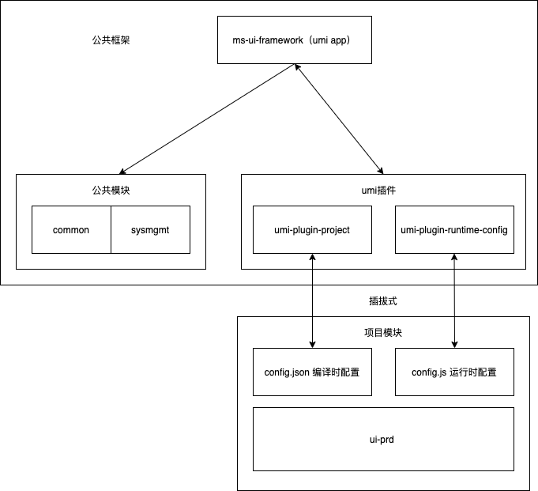

## umi-plugin-project

解决的是使用umi框架时分项目模块开发的需求

### 痛点

如公司同时启动了多个项目或产品，而这几个项目和产品隶属于不同的团队和部门，但是都有着同样的基础功能，

比如一些公共的系统功能
登陆退出逻辑、sso单点登陆功能、用户管理模块、组织管理模块、角色管理模块、权限管理模块、系统参数管理模块、……

比如一些项目定制的需求
logo、appName、theme……

比如一些公共前端功能
模块路由、模块的接口代理、布局方式、全局水印、仪表板……

我们如果是copy一个脚手架，然后每个项目部门都从头开发开发这些基础功能，就非常耗时耗力

### 方案
所以，可以采取一种可插拔的方式实现项目模块的隔离开发，这就是umi-plugin-project 和runtimeConfig.plugin.js所做的事


### 实现
umi-plugin-project 主要逻辑就是抓取了pages下的页面模块然后重载config进行依据order参数的merge覆盖，实现项目模块路由的挂载，项目模块请求代理的挂载，实现project的各种定制化需求

这些config的使用逻辑要预埋在主框架当中，如若是项目不需要的功能，可以通过config参数控制此功能不打入bundle

### 强制约定
项目模块：pages下的第一层目录，如 src/pages/sysmgmt
项目模块编译时配置：页面模块目录下的config.json, 如src/pages/sysmgmt/config.json
必有参数：

| 参数名      | 描述                                           | 类型     | 必传 |
| ----------- | ---------------------------------------------- | -------- | ---- |
| order       | 多个模块config merge时的顺序，数字越大权重越高 | number   | true |
| proxyTarget | 前端开发时接口代理地址，就是umi的proxy的target    | string   | 必传 |
| routes      | 项目模块的路由定义，就是umi的routers           | object[] | 必传 |

其他配置可以自定义，这些配置参数会被注入到umi 的 define, 成为全局变量

项目模块运行时配置：页面模块目录下的config.json, 如src/pages/sysmgmt/config.js


### config.json示例
``` json
{
  "order": 1,
  "proxyTarget": "http://192.168.2.148:8080",
  "routes": [{
      "path": "/**/currentprocess",
      "component": "./sysmgmt/accountcenter/currentprocess"
    }
  ],
  "MAIN_CONFIG": {
    "primaryColor": "#027aff",    //主色
    "siderMenuBackground": '#fff', // 导航背景色
    "siderMenuTextColor": '#000', // 导航文字色
    "siderMenuLogoBackground": "#fff", // logo背景色
    "siderMenuLogoColor": "#000", // logo文字色
    "siderMenuCollapsed": true,    //左侧菜单默认收缩
    "globalHeaderBackground": "#fff", // header背景色
    "globalHeaderTextColor": "#202020", // header文字色
    "theme": "classic",   //主题
    "themeType": "light",  //主题类型
    "navTheme": "light",   //导航主题类型
    "layout": "sidemenu",  
    …… 
  }
}

```

### 注意
此插件解决的编译时配置的处理，即config.json, 如果需要运行时配置config.js的处理，可结合使用运行时配置插件 umi-plugin-runtime-config

